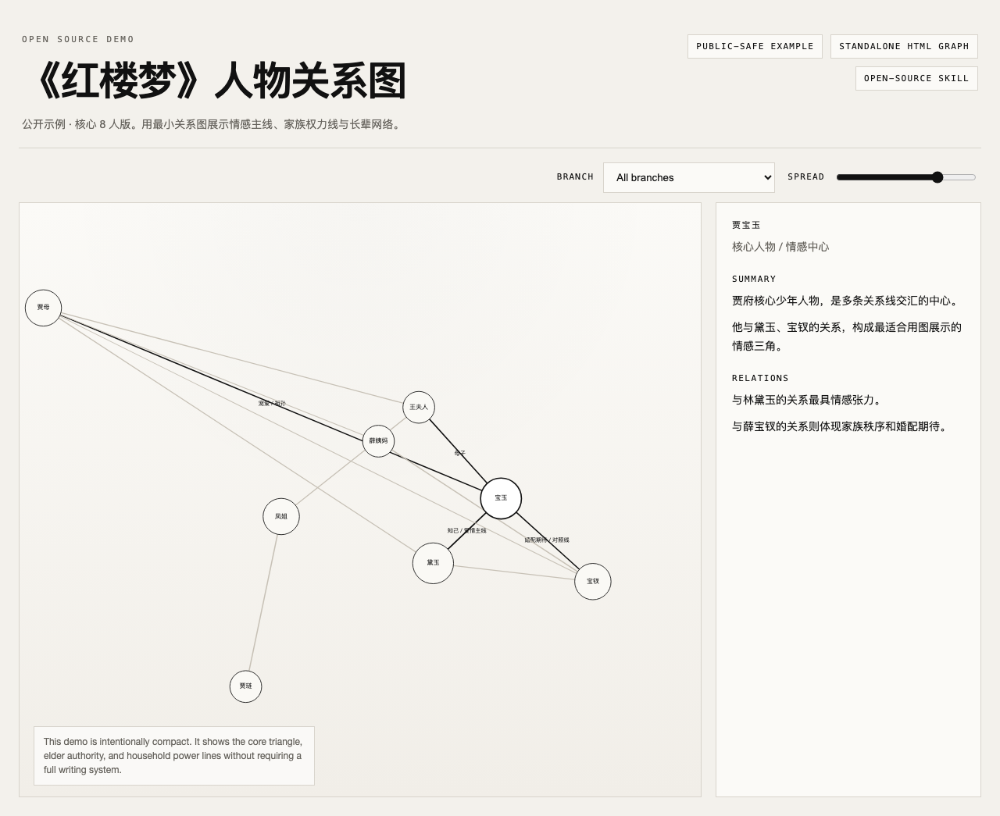

# novel-characters-force

一个脱敏后的、可开源的薄 skill。

它只解决一件事：

- 当小说人物太多、关系太乱时，把人物关系提炼成一张可拖拽、可筛选、可直接打开的静态 HTML 图。

它不是完整写作系统，也不要求你先维护 Obsidian、YAML 数据库、时间线流水线或伏笔库。



## 这是什么

这个仓库包含 3 层内容：

1. `skill/novel-characters-force/`
   - 真正可复用的 skill 包
   - 含 `SKILL.md`、viewer 资产、示例数据、最小 schema、agent 元数据

2. `demo/`
   - 一个直接可打开的公开演示页
   - 当前示例使用《红楼梦》核心 8 人版

3. `docs/`
   - 开源说明和验收截图

## 适合什么场景

- 你在写小说，人物越来越多，已经开始混乱
- 你在读小说，想快速看懂谁和谁是什么关系
- 你想分享一个“轻量可视化能力”，而不是分享一套重型流程

## 不适合什么场景

这个仓库不做：

- 章节管理系统
- 伏笔管理系统
- 时间线系统
- Obsidian 专属数据工作台
- 大型存量项目整体迁移

如果你要的是“完整小说操作系统”，这个仓库故意不往那个方向长。

## Demo

公开 demo 使用《红楼梦》，原因很简单：

- 公共安全
- 人物密集
- 关系复杂
- 一眼就能看出图有没有价值

直接打开：

- [demo/index.html](./demo/index.html)

如果你想直接看一个已经选中人物的视角，可以打开：

- `demo/index.html?select=jia_baoyu`

这套 demo 已经验证过：

- `file://` 可直接打开
- `http://localhost` 也可正常使用

这里有两种 demo 形态，作用不同：

- `demo/`
  - 仓库内预览页
  - 方便你直接查看《红楼梦》示例效果
  - 为了复用公共 viewer，引用了 `skill/novel-characters-force/assets/...`
- `scaffold_demo.sh` 生成的输出目录
  - 独立可分发版本
  - 目录内只保留 `index.html`、`style.css`、`graph.js`、`graph-data.js`
  - 可以直接复制出去单独使用

## 本地运行

### 方式一：直接打开

```bash
open demo/index.html
```

### 方式二：本地 HTTP

```bash
cd novel-characters-force
python3 -m http.server 8000
open http://127.0.0.1:8000/demo/
```

## 5 分钟 Quickstart

### 先跑通公开示例

```bash
bash skill/novel-characters-force/scripts/scaffold_demo.sh ./out/hongloumeng-demo
open ./out/hongloumeng-demo/index.html
```

这会生成一个独立目录，默认使用仓库自带的《红楼梦》示例数据。

## 如何把它当 skill 用

skill 在这里：

- [skill/novel-characters-force/SKILL.md](./skill/novel-characters-force/SKILL.md)

如果你要装进本地 Codex/OpenClaw skills 目录，最直接的方式是复制整个文件夹：

```bash
cp -R skill/novel-characters-force ~/.codex/skills/
```

确认方式：

- 重启或刷新你的 Codex / OpenClaw skill 列表
- 检查是否能在本地 skills 目录里看到 `novel-characters-force`
- 在对话里直接提到 `novel-characters-force`

然后在对话里触发类似请求：

- “把这部小说的人物关系整理成可视化关系图”
- “根据这几章内容提取角色关系并生成静态 HTML”
- “我在读一本人物很多的小说，帮我做一个可拖拽关系图”

一个更稳的最小提示词可以直接这样写：

```text
使用 novel-characters-force。

基于我下面给你的材料，提取 6-12 个核心人物和 8-20 条关键关系，输出一个轻量人物关系图。

请生成一个可直接打开的静态 HTML 目录到 ./out/my-novel-graph ，目录内必须包含：
- index.html
- style.css
- graph.js
- graph-data.js

要求：
- 最终目录必须支持直接双击 index.html 打开
- 不要扩展成完整写作系统
- 如果人物太多，优先删掉次要人物
- 分组筛选如果保留，请使用稳定的 group id
```

## 最小输入

这套 skill 刻意接受轻输入。

你不需要先建系统，只要给下面任一种就够：

- 一段小说简介
- 一份人物表
- 若干章节正文
- 一份已有的人物关系笔记

推荐压缩到：

- 6-12 个核心人物
- 8-20 条关键关系

## 最小输出

viewer 只依赖一个 `graph-data.js`：

```js
window.charactersForceGraph = {
  title: "你的小说标题",
  groups: [{ id: "core", label: "核心关系" }],
  nodes: [],
  links: []
};
```

推荐约定：

- `groups` 使用 `{ id, label }`
- `node.groups` 填 group `id`
- `weight` 控制在 `1-5`

完整约定见：

- [skill/novel-characters-force/references/schema.md](./skill/novel-characters-force/references/schema.md)

公开示例见：

- [skill/novel-characters-force/assets/examples/hongloumeng.graph-data.js](./skill/novel-characters-force/assets/examples/hongloumeng.graph-data.js)

## 仓库结构

```text
novel-characters-force/
├── demo/
│   └── index.html
├── docs/
├── skill/
│   └── novel-characters-force/
│       ├── agents/
│       │   └── openai.yaml
│       ├── SKILL.md
│       ├── assets/
│       │   ├── examples/
│       │   └── viewer/
│       ├── references/
│       └── scripts/
├── LICENSE
└── README.md
```

## 一键生成一个新 demo

仓库里已经带了脚本：

```bash
bash skill/novel-characters-force/scripts/scaffold_demo.sh ./out
```

它会复制：

- `index.html`
- `style.css`
- `graph.js`
- `graph-data.js`

到你指定的目录。

这个输出目录是独立的，不依赖仓库里的相对路径。

## 脱敏边界

这个仓库已经刻意排除了这些东西：

- 私人小说正文
- 私人人物名
- 本机绝对路径
- 内部提示词残留
- 只适合个人长期维护的重型流程

如果你基于这个仓库继续公开自己的版本，发之前建议再扫一次：

- 绝对本机路径
- 私人书名 / 角色名
- 项目专属 group filter
- 内部注释和临时脚本

## 路线图

- `v1`
  - 薄人物关系图 skill
- `v1.1`
  - 更顺手的导出脚本
- `v2`
  - 独立的 timeline skill，而不是把 timeline 硬塞进这里

## License

MIT
