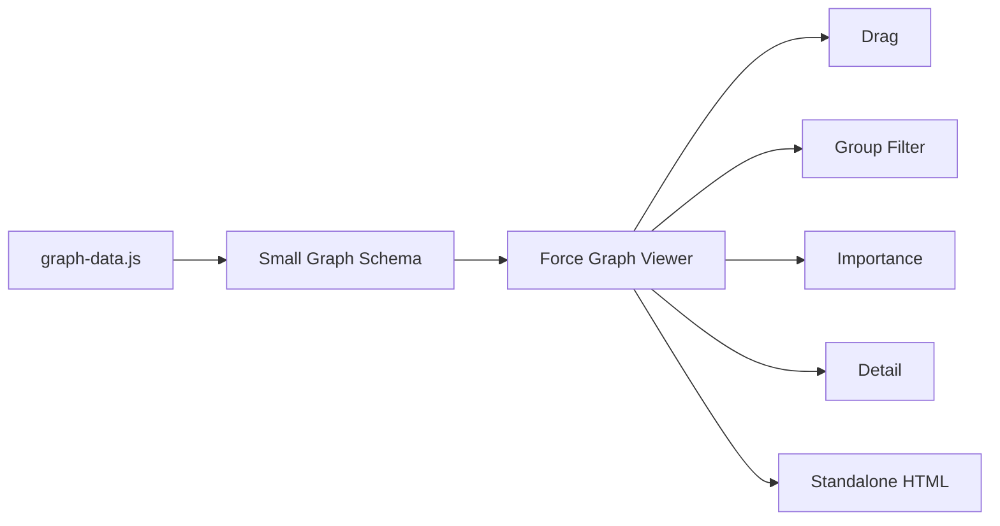
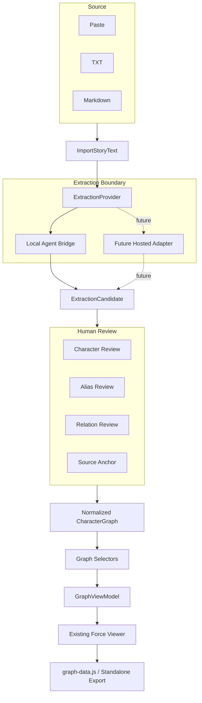
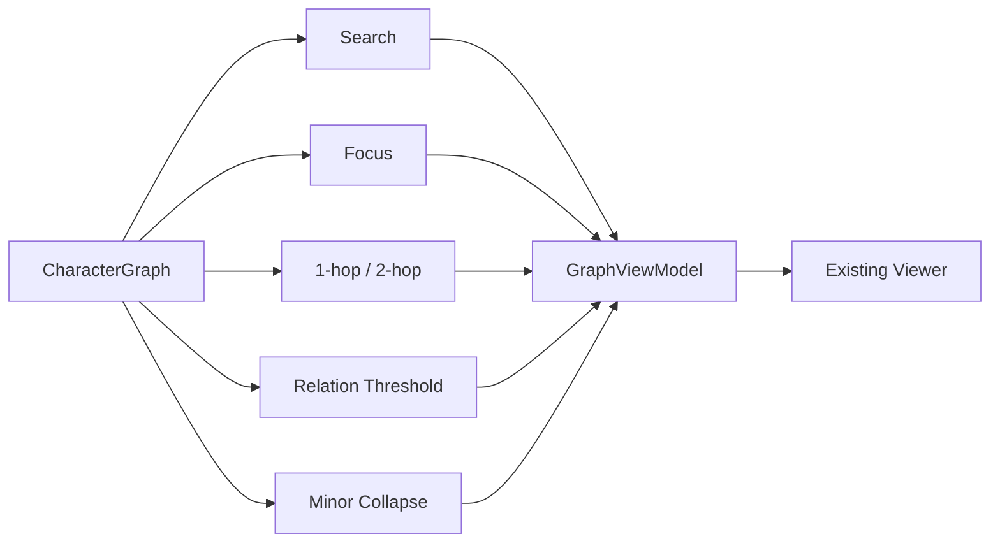
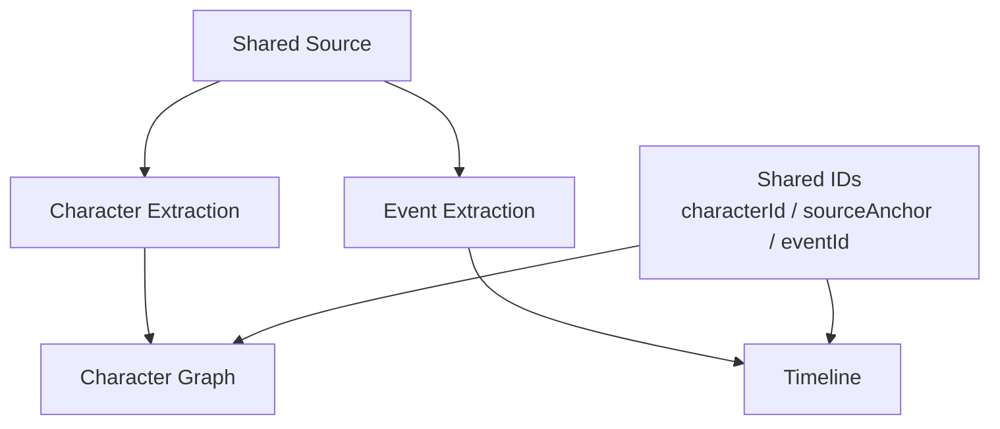

# Novel Characters Force：当前架构 vs 理想产品架构

日期：2026-09-18  
Issue：
- Mainline: https://github.com/EOMZON/novel-characters-force/issues/1
- P0 Import + Review: https://github.com/EOMZON/novel-characters-force/issues/2
- P1 Focus / Density: https://github.com/EOMZON/novel-characters-force/issues/3
- P2 Timeline: https://github.com/EOMZON/novel-characters-force/issues/4

## 1. 当前产品真相

当前已经有一个可靠的 open-source core：



已实现：
- 静态 HTML viewer
- draggable force graph
- node weight
- group filter
- detail panel
- file://
- localhost
- standalone scaffold
- public-safe demo
- MIT skill

当前主要缺口不是 renderer，而是：

```text
自然语言小说文本
→ ???
→ graph-data.js
```

## 2. 最初用户需求与证据

XHS 已抓到 17/56 评论，属于部分证据，不能外推全量。

明确观察到：
- “小说怎么导入”
- “怎么用”
- “如果能把情节显示出来更好”
- “感觉更乱了”
- 游戏 / 单词关系图等邻近用法

因此 adoption blocker 优先级：

```text
Import / How to use
> Density / Focus
> Timeline
```

## 3. 理想 P0 架构



## 4. 分层职责

```text
source/
  SourceDocument

application/
  ImportStoryText
  PrepareExtraction
  ReviewExtraction
  BuildCharacterGraph

domain/
  ExtractionCandidate
  CharacterCandidate
  RelationCandidate
  SourceAnchor
  CharacterGraph

infrastructure/
  ExtractionProvider
  AgentBridgeProvider
  FutureHostedProvider

selectors/
  GraphFocusSelector   # P1

view-model/
  ImportReviewViewModel
  GraphViewModel

presentation/
  ImportPanel
  CandidateReview
  GraphPreview
```

### 硬规则

- UI 不直接绑定某个模型响应；
- UI 不保存 provider API key；
- alias / relation normalization 不写在 DOM handler；
- renderer 不理解模型响应；
- graph viewer 继续只吃 normalized graph；
- P0 不重写 force renderer；
- public demo 继续安全。

## 5. P0 第一阶段的真实边界

当前 feature candidate 首先跑通：

```text
Paste / TXT / MD
→ SourceDocument
→ Agent Bridge Prompt
→ Candidate JSON
→ Human Review
→ Normalized CharacterGraph
→ Existing Viewer Preview
→ graph-data.js export
```

为什么先用 Agent Bridge：

- 开源仓不应要求浏览器保存 API key；
- 当前没有已授权 Hosted backend；
- 不应为了“看起来自动”在浏览器里伪造模型；
- Provider contract 先稳定，未来 Hosted adapter 可以替换，不改 UI/domain。

这不是最终的“一键 AI”，但是真正的产品层 foundation，不再要求用户手写 `graph-data.js`。

## 6. P1 Density 架构



原则：

```text
UI filter != delete graph source
```

## 7. P2 Timeline sibling



Timeline 不进入 Character Graph v1 schema。

## 8. 当前 vs 理想

| 层 | 当前 | 理想 | 差距 |
|---|---|---|---|
| Source input | README / Skill 输入 | Paste / TXT / MD 产品入口 | P0 |
| Extraction | Agent skill 隐式完成 | Provider contract + candidate | P0 |
| Review | 无产品 UI | 人物/别名/关系校对 | P0 |
| Graph domain | small public schema | normalized graph | 小幅扩展 |
| Viewer | 已完成 | 复用 | 不重写 |
| Density | group only | search/focus/hops | P1 |
| Distribution | developer demo | Try your text | P1 |
| Timeline | 无 | sibling module | P2 |

## 9. Git / Worktree

当前治理：

```text
main@670792c
↓
test@012c18f
↓
feat/zero-friction-import-review-20260918
```

后续必须：

```text
SOURCE_SAVED
→ MERGED
→ SEMANTICALLY_RECONCILED
→ TARGET_VERIFIED
→ CONSUMER_UPDATED
```

不能因为 PR merged / worktree=1 就声称产品已同步。

治理：
https://github.com/EOMZON/codex-skills-private/blob/9a8e385ccc98f068b0990133f9a2e80681ffa9ec/github-ops/references/test-main-governance.md
